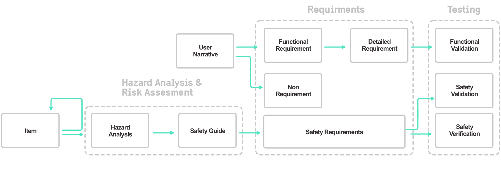
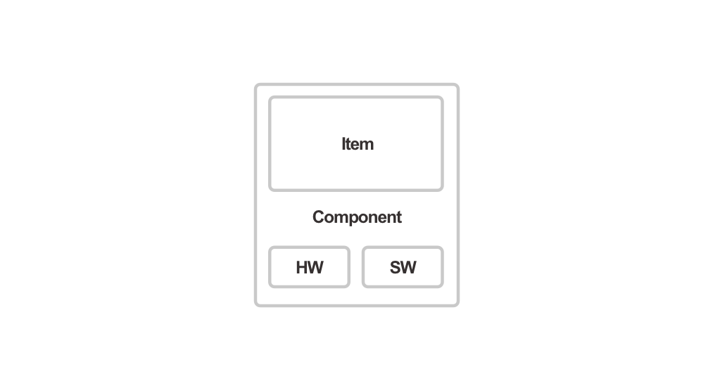
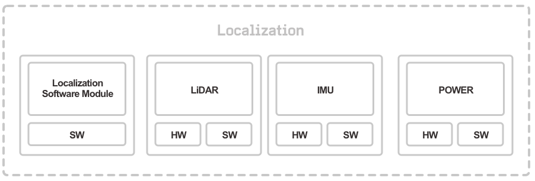

:::warning ALPHA
Work In Progress
:::

# Overview

OAS models its safety approach after the ISO 26262 standard for automotive safety. Without a driver to identify and mitigate failures, autonomous vehicle systems need robust requirements and a comprehensive, well-defined process for analyzing risk and validating capabilites.

The following is an overview of our requirements lifecycle.

[[toc]]

## Functional Safety Flow
Beyond the functional safety standards of traditional production vehicles, the goal of the functional safety flow is to provide validation coverage and risk mitigation.

The functional safety flow consists of the following steps: 

1. Items of the autonomous system are identified and defined.
2. Hazard analysis and risk assessment is performed for each item. Safety ratings are assigned to each hazard and safety goals are determined.
3. Safety requirements are determined.
4. Verification is performed on safety requirements.
5. Validation test plans are created and executed.

### Items

* An item is a unit of an autonomous system. It is meant to represent a group of components that work together to perform a specific task, like localization or steering the car.
* An item will be made up of more specific components and/or other items

::: tip Example
Localization is an Item. It has a specific goal in the autonomous system and is comprised of multiple components.
:::

* The ISO 26262 standard defines an item as having at least one component. Each component is comprised of hardware and software units.

::: tip Example
The localization Item encompasses all aspects of the localization system, including the LIDAR devices (which are composed of hardware and firmware) and the localization software module.
 

:::

## Hazard Analysis & Risk Assessment
* We perform Hazard Analysis & Risk Assessment (HARA) on each item to determine how rigorous our validation needs to be.
* HARA leaves us with various hazards and safety goals for each item. We assign a safety rating to each hazard based on the ASIL rating system, which is determined from the hazard’s controllability, exposure, and severity (how likely someone will be seriously injured). That rating will be used to determine how rigorous our verification step needs to be.
* Higher ASIL ratings signify a higher degree of safety integrity because of the needed safety measures to mitigate risks.
* Each hazard associated with each item will have corresponding safety goals.

::: tip Example
Using localization as an item, one hazard would be "sending an incorrect localization pose." For that Hazard, one Safety Goal would be "always send correct localization pose." A HARA analysis of this goal would then result in an ASIL Rating of D (most dangerous).
:::

## Safety Requirements
An exhaustive list of safety requirements are determined that satisfy the Safety Goals. These are granular, testable requirements that will subsequently be verified and validated.

::: tip Example
Using "always send correct localization pose" as a safety goal, we would require software to check that that we are sending the correct localization pose.
:::

## Safety Verification
Code reviews, unit tests, etc, are used to determine if the code is “good code.” The rigor of these are based on the corresponding safety goal’s ASIL rating.

Verification should answer the question, “did I build what I need?”

::: tip Example
An ASIL rating D means we would do some combination of design inspection, simulation, prototype generation, formal verification, and data flow analysis.
:::

## Safety Validation
Tests are used to determine whether a safety requirement has been satisfied. This is commonly done using a combination of simulation and field testing.

::: tip Example
Stop execution of localization module. Watchdog module correctly identifies that localization is stale.
:::

# Functional Requirements Flow
The goal with the Functional Requirements flow is to define what the car should do in various scenarios.

1. User Narratives are detailed.
2. High level Functional Requirements and Non-Requirements are defined to determine the scope of the functionality of the autonomous vehicle. Depending on the environmental needs and determined operational domain, some deployments may require different requirements.
3. Detailed Requirements are created from the Functional Requirements, which are more granular and testable.

## User Narrative
A high-level, informal story which is used to inform and develop functional rRequirements. User narratives are generally long stories which inform high-level functional requirements.

::: tip Example
A portion of a user narrative could be "The autonomous vehicle proceeds to its destination, stopping at stop signs and yielding for pedestrians in crosswalks."
:::

## Functional Requirements
High-level requirements describe the overall functionality of the autonomous vehicle.

::: tip Example
Using the above example as a user narrative, one functional requirement would be simply "Yield to Pedestrians at Crosswalks."
:::

## Non-Requirements
We also find it useful to enumerate the functional requirements that are *not* currently in our scope.

::: tip Example
There are no stoplights in our current deployments, so "Detect and Respond to Stoplights" would be a non-requirement.
:::

## Detailed Requirements
These are more specific and granular than functional requirements and define a specific and testable action (or reaction) by the autonomous vehicle. These are each based off a functional requirement.

::: tip Example
Using "Yield to Pedestrians at Crosswalks", one detailed requirement would be "stop 3 feet in front of the crosswalk annotation if a pedestrian is actively occupying the crosswalk." Another would be "after a pedestrian has left the crosswalk, Ego proceeds through the crosswalk."
:::

## Functional Validation
Tests are used to determine whether a detailed requirement has been satisfied. This is done using a combination of simulation and field testing. We define these [scenarios](../scenarios/) using the [OAS Toolkit](../testing-toolkit/).

::: tip Example
Using the above detailed requirements,  the following example could be used to partially validate both.

[example crosswalk scenario](../scenarios/crosswalks.html#pedestrian-already-in-crosswalk)
:::
