# Car Following

:::warning ALPHA
Work In Progress
:::

[[toc]]

## Follow lead vehicle
**2-2-XX-CF-STR-CAR**

Ego follows lead vehicle that is going **X** speed

|    |                                    |          |
| -- | ---------------------------------- | -------- |
|  A  | 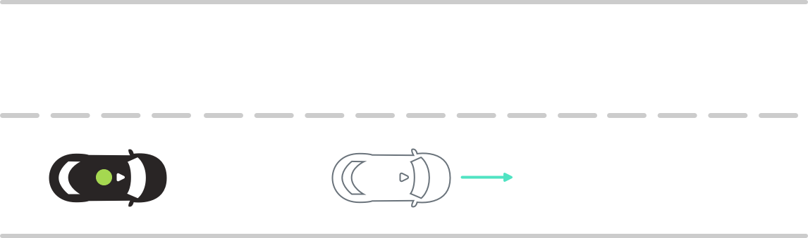 | **Scenario**   Lead vehicle drives ahead of Ego.    **Expected Result**   Ego follows lead vehicle while maintaining minimum following distance and never exceeds speed limit.  |

## Follow lead vehicle that suddenly stops
**2-2-XX-CF-STR-CAR:01**

Ego follows lead vehicle that is going **X** speed that suddenly stops

|    |                                    |          |
| -- | ---------------------------------- | -------- |
|  A  | 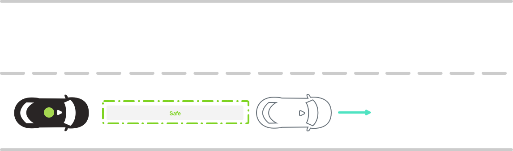 | **Scenario**   Lead vehicle drives ahead of Ego.    **Expected Result**   Ego follows lead vehicle while maintaining minimum following distance and never exceeds speed limit.  |
|  B  | 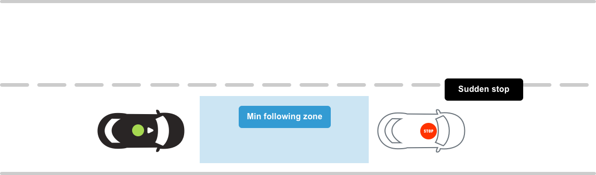 | **Scenario**   Lead vehicle suddenly comes to a full stop.    **Expected Result**   Ego stops behind lead vehicle.  |
|  C  | 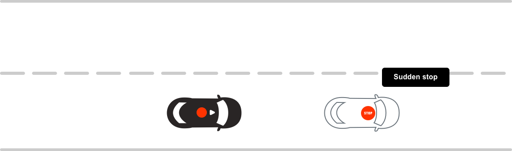 | **Scenario complete 🎉**  |

## Follow lead vehicle that is stopping and going
**2-2-XX-CF-STR-CAR:02**

Ego follows lead vehicle that is stopping and going

|    |                                    |          |
| -- | ---------------------------------- | -------- |
|  A  | 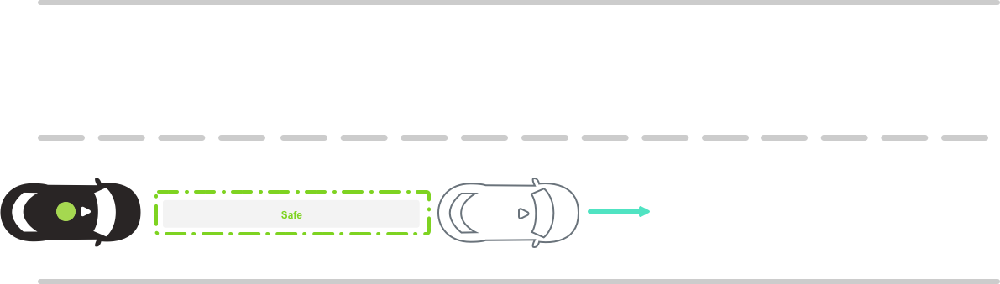 | **Scenario**   Lead vehicle drives ahead of Ego.    **Expected Result**   Ego follows lead vehicle while maintaining minimum following distance and never exceeds speed limit.  |
|  B  | 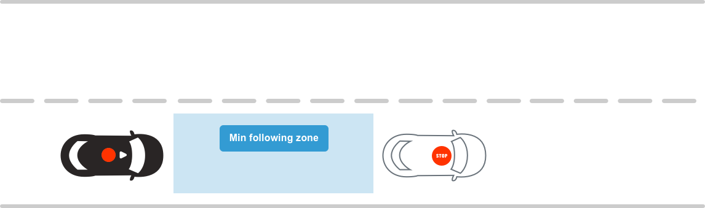 | **Scenario**   Lead vehicle comes to a stop.    **Expected Result**   Ego stops behind lead vehicle.  |
|  C  | 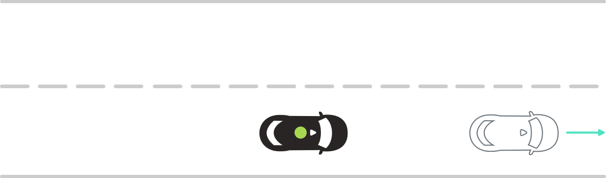 | **Scenario**   Lead vehicle starts driving again, stopping and going periodically.    **Expected Result**   Ego follows lead vehicle while maintaining minimum 4 second following distance, never exceeds speed limit (even if the lead vehicle does,) and stops behind lead vehicle.  |

## Lead vehicle cuts in
**2-2-XX-CF-STR-CAR:Pa>E:03**

A secondary vehicle cuts in ahead of Ego

|    |                                    |          |
| -- | ---------------------------------- | -------- |
|  A  | 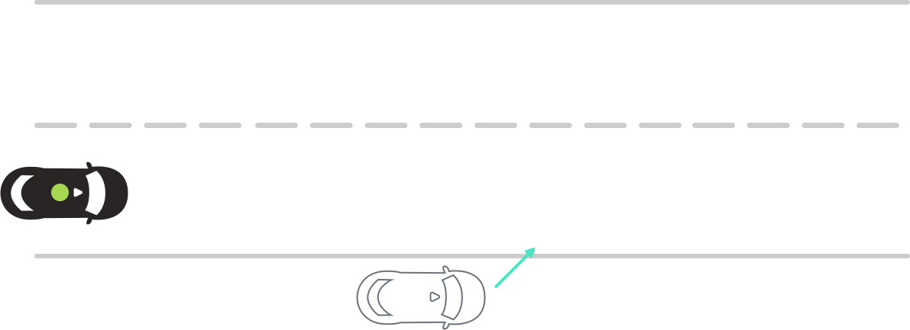 | **Scenario**   Secondary vehicle cuts in ahead of Ego inside the safe following distance.    **Expected Result**   Ego slows down and follows lead vehicle.  |
|  B  | 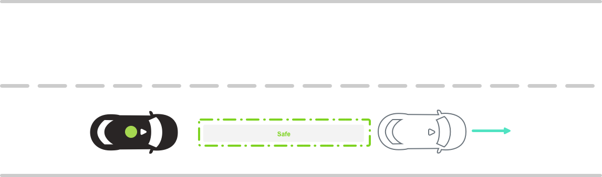 | **Scenario complete 🎉**  |

## Lead vehicle cuts out
**2-2-XX-CF-STR-CAR:E>Pa:04**

Lead vehicle cuts out of Ego's lane of travel

|    |                                    |          |
| -- | ---------------------------------- | -------- |
|  A  | 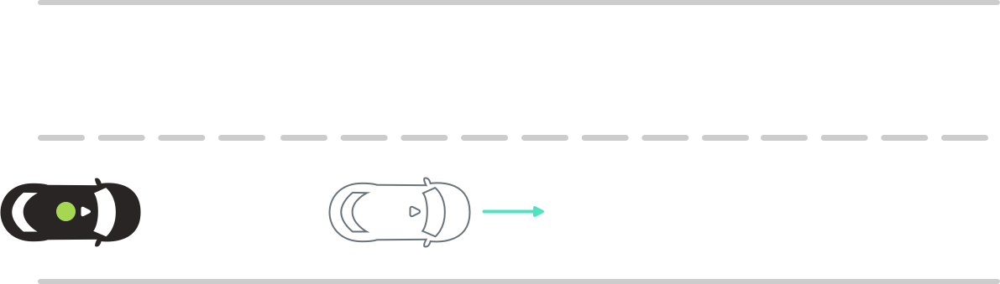 | **Scenario**   Lead vehicle drives ahead of Ego.    **Expected Result**   Ego follows lead vehicle while maintaining minimum 4 second following distance and never exceeds speed limit.  |
|  B  |  | **Scenario**   Lead vehicle cuts out of Ego's lane of travel.    **Expected Result**   Ego continues traveling in lane of travel.  |
|  C  | 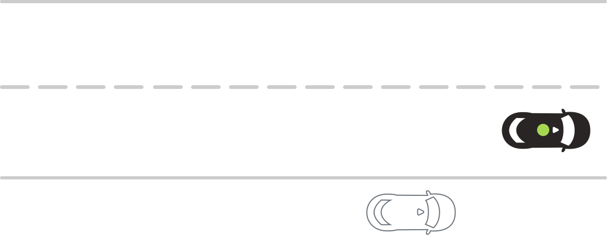 | **Scenario complete 🎉**  |

## Lead vehicle breaks speed limit
**2-2-XX-CF-STR-CAR:05**

Lead vehicle speeds away and breaks speed limit

|    |                                    |          |
| -- | ---------------------------------- | -------- |
|  A  | 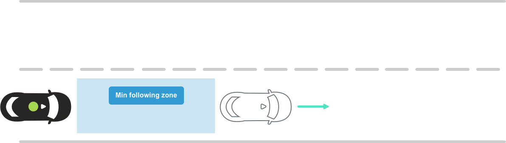 | **Scenario**   Lead vehicle drives ahead of Ego.    **Expected Result**   Ego follows lead vehicle while maintaining minimum 4 second following distance and never exceeds speed limit.  |
|  B  | 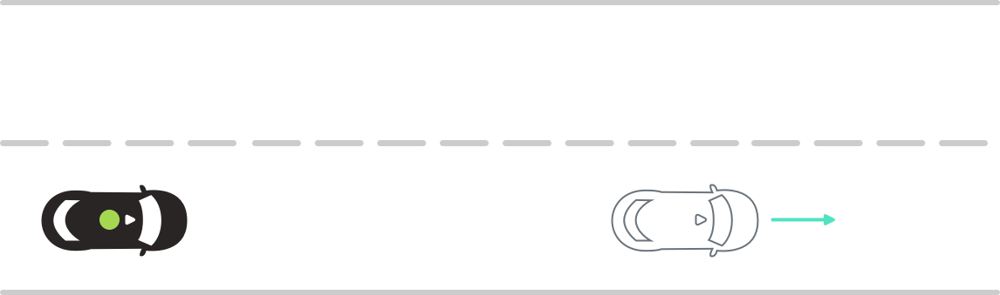 | **Scenario**   Lead vehicle accelerates and drives over the speed limit.    **Expected Result**   Ego continues driving but does not surpass speed limit  |
|  C  | 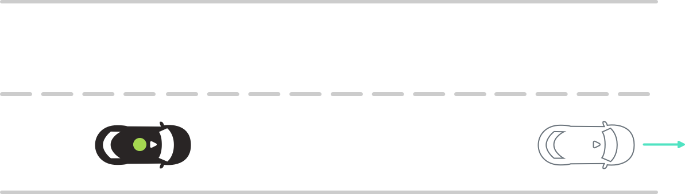 | **Scenario complete 🎉** |
