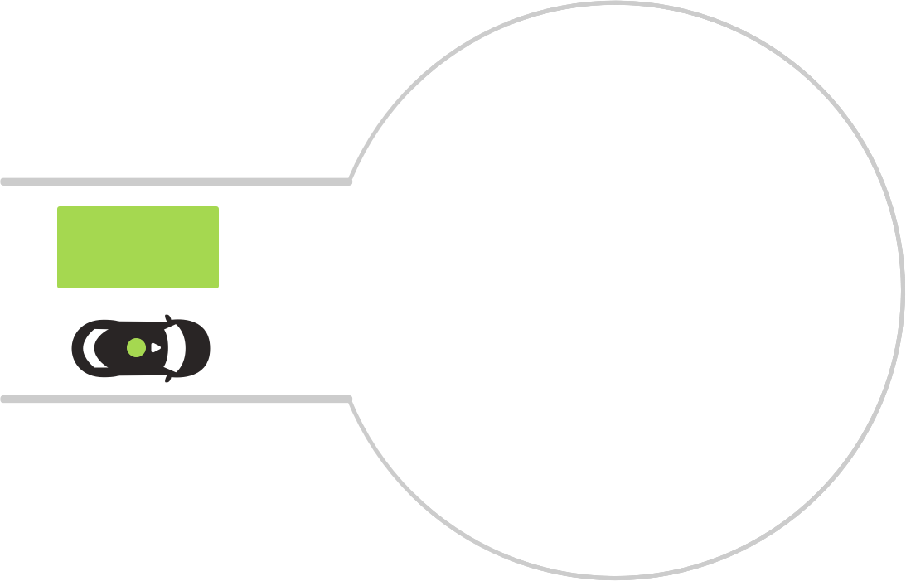
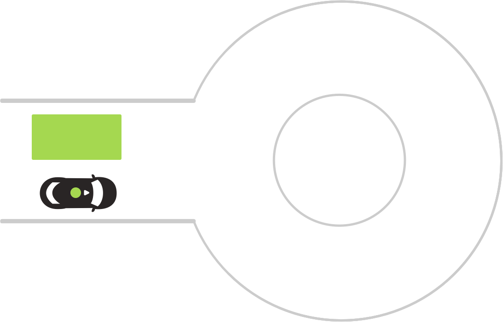
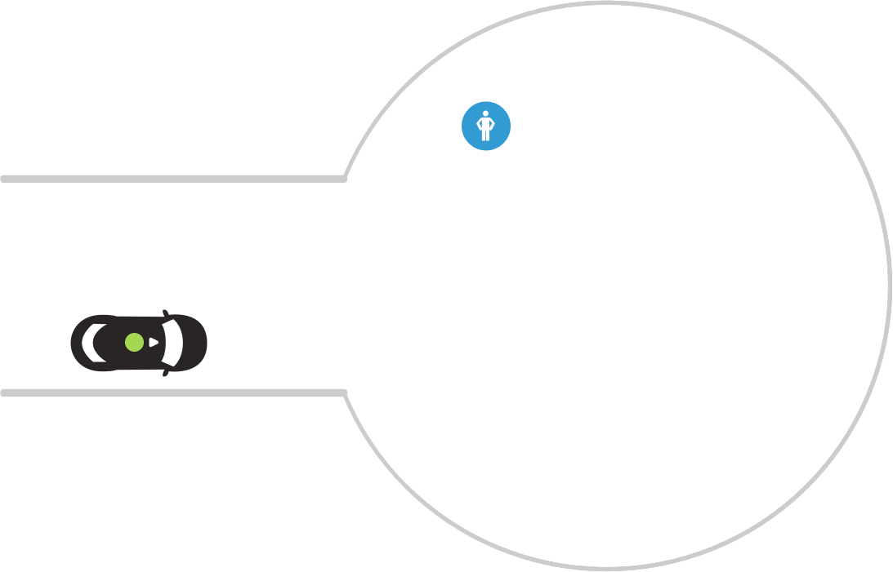
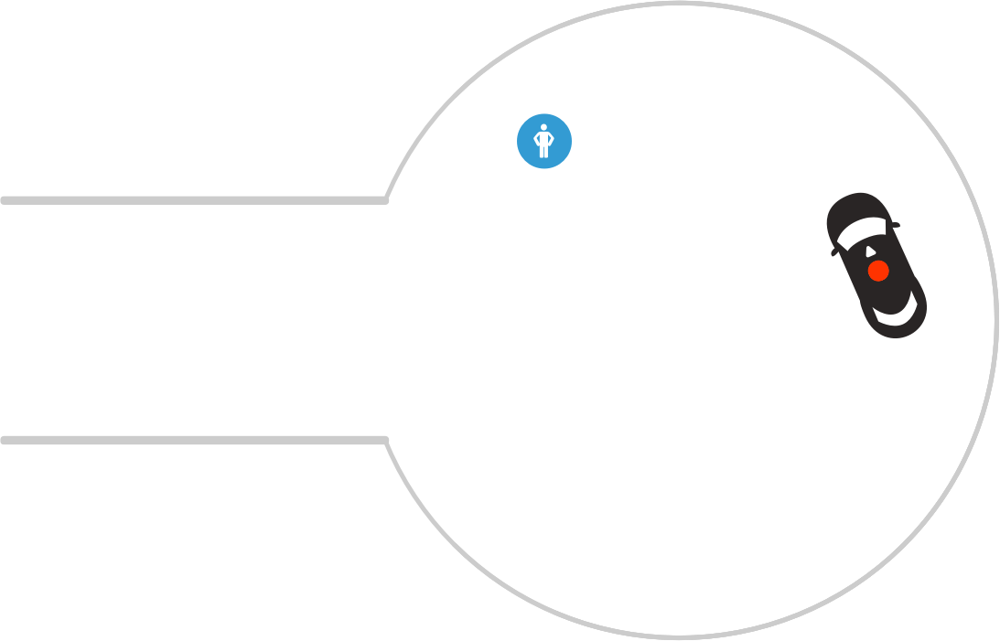
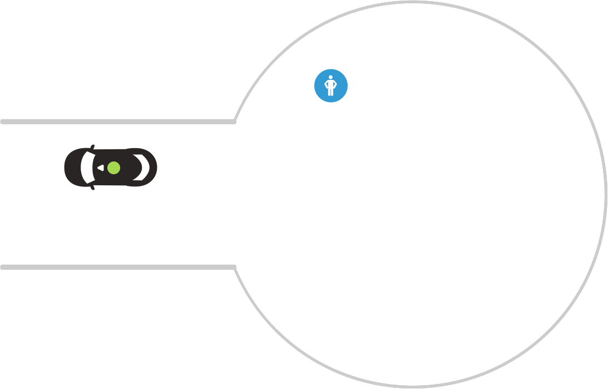

# Cul-de-sacs

:::warning ALPHA
Work In Progress
:::

[[toc]]

## Cul-de-sac
**OAS-CDS-01**

Ego approaches cul-de-sac

|      |     |     |
| :--: | --- | --- |
| A    |  | **Scenario**   Ego approaches a cul-de-sac.    **Expected Result**   Ego reduces speed by 20 percent, enters the cul-de-sac from the right hand portion of the road, and proceeds counterclockwise. |

## Raised island
**OAS-CDS-02**

Ego approaches cul-de-sac with an island at its center

|      |     |     |
| :--: | --- | --- |
| A    |  | **Scenario**   Ego approaches cul-de-sac with an island.    **Expected Result**   Ego reduces speed by 20 percent, enters the cul-de-sac from the right hand portion of the road, and proceeds counterclockwise. |

## With pedestrian or object
**OAS-CDS-03**

Ego approaches cul-de-sac with pedestrian in roadway

|      |     |     |
| :--: | --- | --- |
| A    |  | **Scenario**   Ego approaches cul-de-sac. Pedestrian stands in cul-de-sac, in Ego's path of travel.    **Expected Result**   Ego reduces speed by 20 percent, enters the cul de sac from the right hand portion of the road, and proceeds counterclockwise. Ego stops for the pedestrian. |
| B    |  | **Scenario**   Pedestrian doesn't move.    **Expected Result**   Ego remains stopped for 8 seconds. |
| C    |  | **Scenario**   Pedestrian doesn't move.    **Expected Result**   Ego navigates around pedestrian, keeping a 3' buffer. |
| D    |  |  **Scenario complete 🎉** |
