# Pedestrians in Road

:::warning ALPHA
Work In Progress
:::

[[toc]]

:::tip Action IDs
**01**: Actor's path will intersect with Ego's path  
**02**: Actor's path will not intersect with Ego's path
:::

## Jaywalking pedestrian
**2-2-XX-PIR-STR-PED:N>S**

Ego approaches jaywalking pedestrian on undivided road

|    |                                    |          |
| -- | ---------------------------------- | -------- |
|  A  | 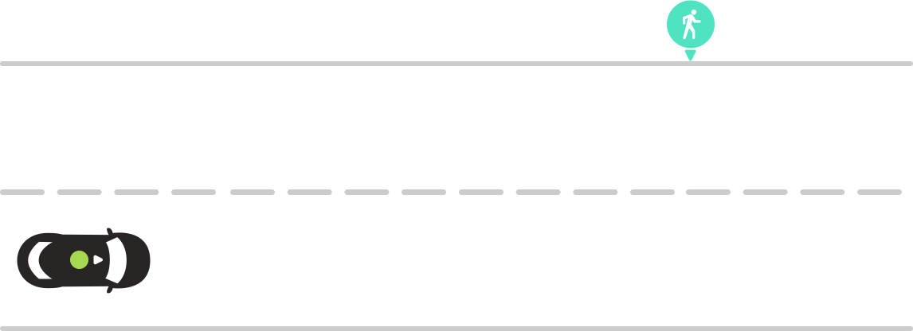 | **Scenario**   Ego approaches pedestrian. Pedestrian stands on side of the road.    **Expected Result**   Ego reduces speed.  |
|  B  | 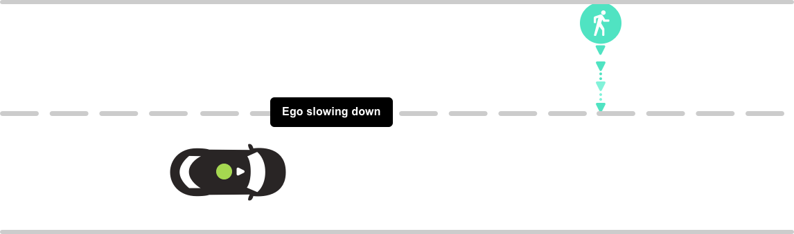 | **Scenario**   Pedestrian enters roadway.    **Expected Result**   Ego comes to a stop in front of pedestrian.  |
|  C  | 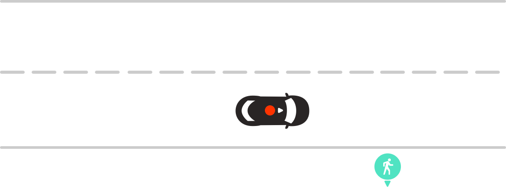 | **Scenario**   Pedestrian exits the road.    **Expected Result**   Ego proceeds.  |
|  D  | 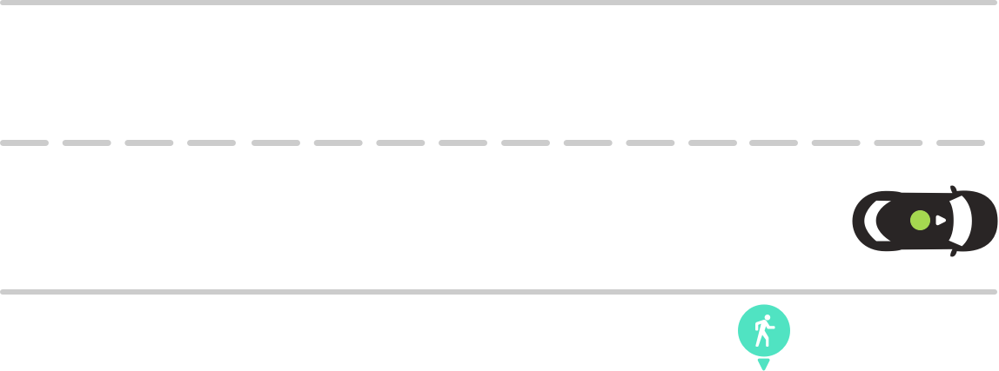 | **Scenario complete 🎉** |

## Jaywalking pedestrian on divided road
**2-2M-XX-PIR-STR-PED:N>S:02**

Ego approaches jaywalking pedestrian on divided road that hasn't entered Ego lane of travel

|    |                                    |          |
| -- | ---------------------------------- | -------- |
|  A  | 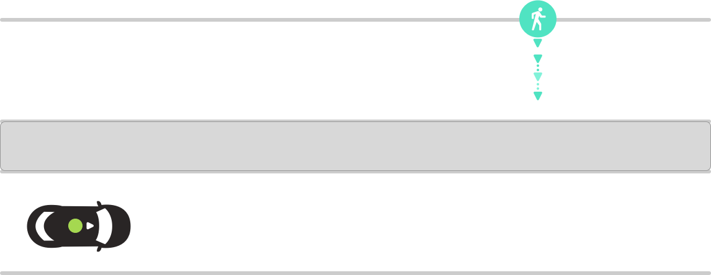 | **Scenario**   Ego approaches pedestrian. Pedestrian leaves roadside from left of the median.    **Expected Result**   Ego reduces speed.  |
|  B  | 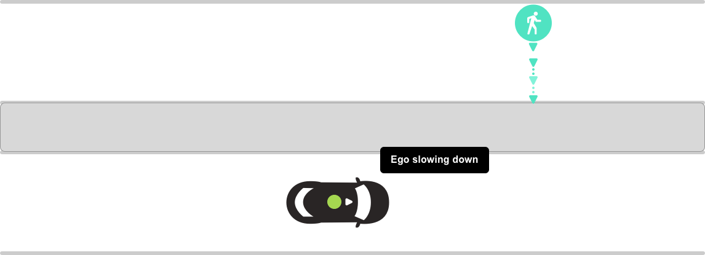 | **Scenario**   Pedestrian continues crossing but has not reached the median or divider of the road.    **Expected Result**   Ego proceeds.  |
|  C  | 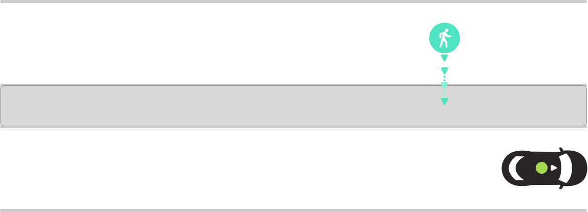 | **Scenario complete 🎉** |

**2-2M-XX-PIR-STR-PED:N>S:01**

Ego approaches jaywalking pedestrian on divided road that has entered Ego lane of travel

|    |                                    |          |
| -- | ---------------------------------- | -------- |
|  A  | 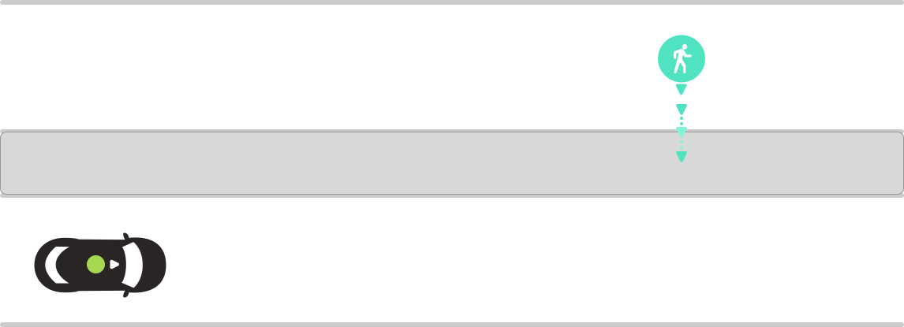 | **Scenario**   Ego approaches pedestrian. Pedestrian approaches from the left and has not reached the median or divider of the road.    **Expected Result**   Ego reduces speed.  |
|  B  | 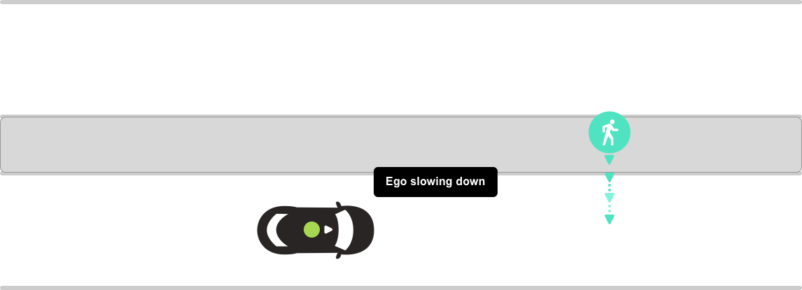 | **Scenario**   Pedestrian reaches median.    **Expected Result**   Ego comes to a stop in front of pedestrian.  |
|  C  | 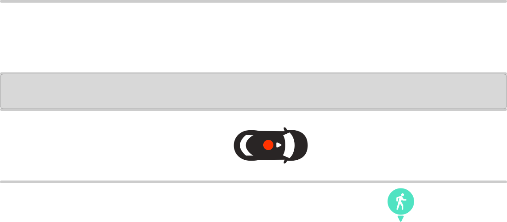 | **Scenario**   Pedestrian exits the road on opposite side.    **Expected Result**   Ego proceeds.  |
|  D  | 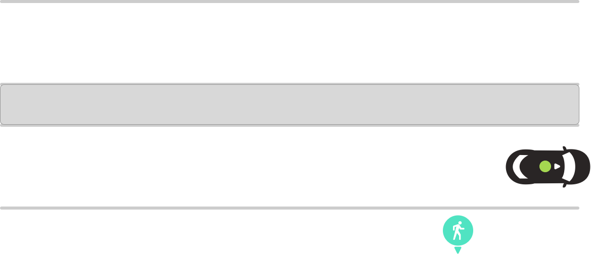 | **Scenario complete 🎉** |
