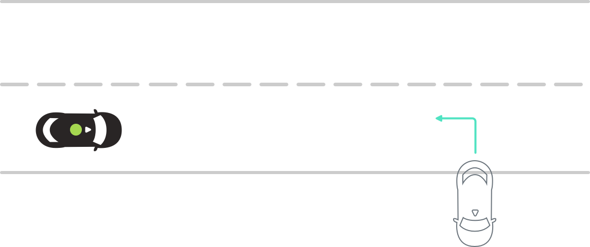
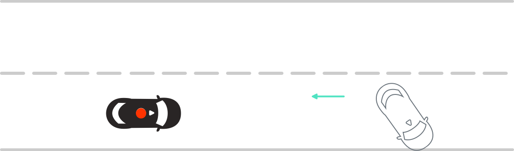
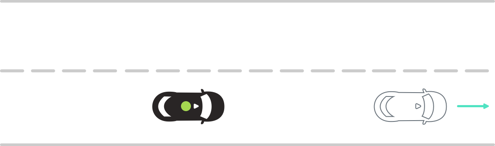

# Reversing Vehicles

:::warning ALPHA
Work In Progress
:::

[[toc]]

:::tip Action IDs
None currently
:::

## Vehicle backing out of driveway
**2-2-XX-RV-STR-CAR:Dr>E**

Ego approaches vehicle backing out of driveway

|    |                                    |          |
| -- | ---------------------------------- | -------- |
|  A  |  | **Scenario**   Ego approaches vehicle. Secondary vehicle begins backing out of a driveway and into Ego's lane of travel.    **Expected Result**   Ego reduces speed and stops with enough room for secondary vehicle to backup and orient itself into the lane of travel.  |
|  B  |  | **Scenario**   Secondary vehicle finishes reverse maneuver and proceeds in lane of travel.    **Expected Result**   Ego proceeds.  |
|  C  |  | **Scenario complete 🎉** |
