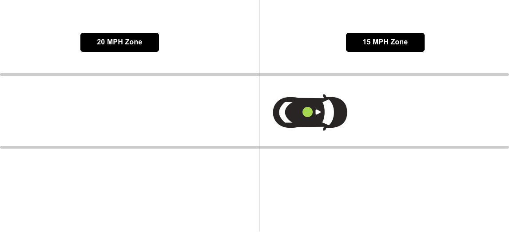

# Speed Limits

:::warning ALPHA
Work In Progress
:::

[[toc]]

:::tip Action IDs
**01**: Speed limit changes
:::

## Single speed zone
**2-1-XX-SL-STR-XX**

Ego in 20 mph speed zone.

|      |     |     |
| :--: | --- | --- |
| A    |  | **Scenario**   Ego in 20 mph speed zone.    **Expected Result**   Ego doesn't exceed 20 mph. |

## Speed zone transition
**2-1-XX-SL-STR-XX:01**

Ego moves from 20 mph speed zone to 15 MPH speed zone.

|      |     |     |
| :--: | --- | --- |
| A    |  | **Scenario**   Ego in 20 mph speed zone approaching a 15 mph speed zone.    **Expected Result**   Ego doesn't exceed 20 mph, decreases speed. |
| B    |  | **Scenario**   Ego moves to a 15 mph speed zone.    **Expected Result**   Ego doesn't exceed 15 mph. |
