# Vehicles in Roadway

:::warning ALPHA
Work In Progress
:::

[[toc]]

## Stationary vehicle
**2-2-XX-VR-STR-CAR:DP**

Ego approaches stopped vehicle on side of road

|      |                                    |             |
| :--: | ---------------------------------- | ----------- |
| A    | 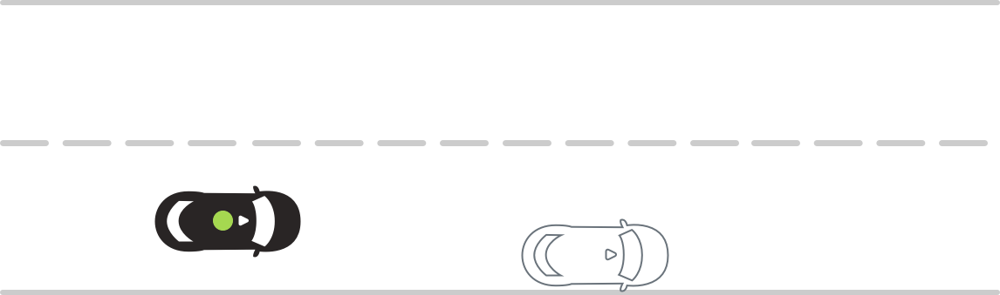 | **Scenario**   Ego approaches a stationary vehicle blocking the lane of travel on the right side of the road.    **Expected Result**  Ego reduces speed and passes the vehicle on the left, maintaining a buffer of 3'. |

## Stationary vehicle with a door open
**2-2-XX-VR-STR-CAR:DP:01**

Ego approaches stopped vehicle on side of road with driver door open

|      |                                    |             |
| :--: | ---------------------------------- | ----------- |
| A    | 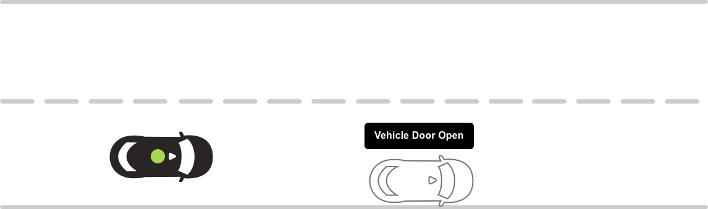 | **Scenario**   Ego approaches a stationary vehicle blocking the lane of travel on the right side of the road with its driver-side door open.    **Expected Result**  Ego reduces speed and passes vehicle on the left, maintaining a buffer of 3'. |

## Car same direction
**2-2-XX-VR-STR-CAR**

Ego approaches car traveling in the same direction

|      |                                    |             |
| :--: | ---------------------------------- | ----------- |
| A    | 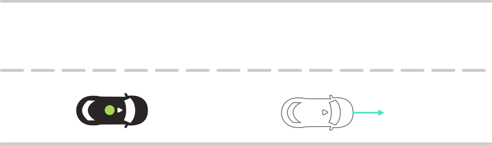 | **Scenario**   Ego approaches a car traveling in the same lane.    **Expected Result**  Ego reduces speed and maintains a following distance.

## Golf cart same direction
**2-2-XX-VR-STR-GC**

Ego approaches golf cart traveling on the right in the same direction

|      |                                    |             |
| :--: | ---------------------------------- | ----------- |
| A    | 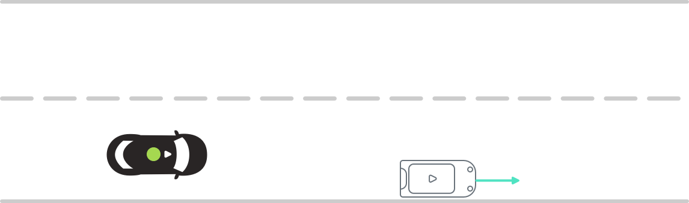 | **Scenario**   Ego approaches a golf cart traveling on the right side of the lane.    **Expected Result**   Ego reduces speed and passes golf cart on the left, maintaining a buffer of 3'. |

## Bicycle traveling same direction
**2-2-XX-VR-STR-BIKE**

Ego approaches bicycle traveling in the same direction on right

|      |                                    |             |
| :--: | ---------------------------------- | ----------- |
| A    | 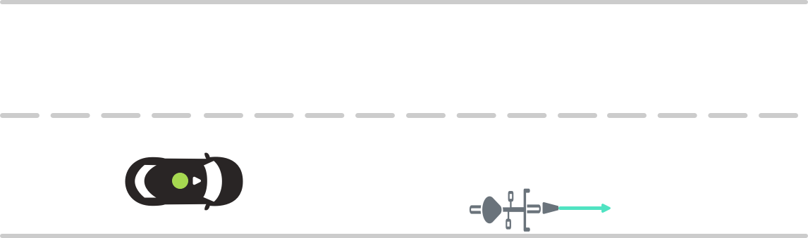 | **Scenario**   Ego approaches a bicycle traveling on the right side ofthe lane.    **Expected Result**  Ego reduces speed and passes golf cart on the left, maintaining a buffer of 3'. |

## Stationary vehicle with oncoming vehicle
**2-2-XX-VR-STR-CAR:DP-CAR:W**

Ego approaches vehicle blocking lane of travel with oncoming vehicle.

|      |                                    |             |
| :--: | ---------------------------------- | ----------- |
| A    | 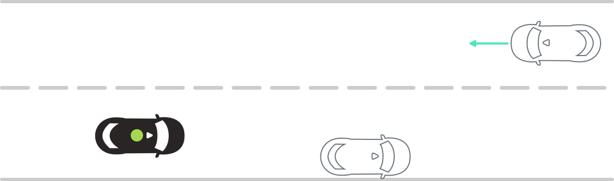 | **Scenario**   Ego approaches a stationary vehicle blocking the lane of travel on the right side of the road. There is an oncoming vehicle in the opposing lane.    **Expected Result**  Ego comes to a stop. |
| B    | 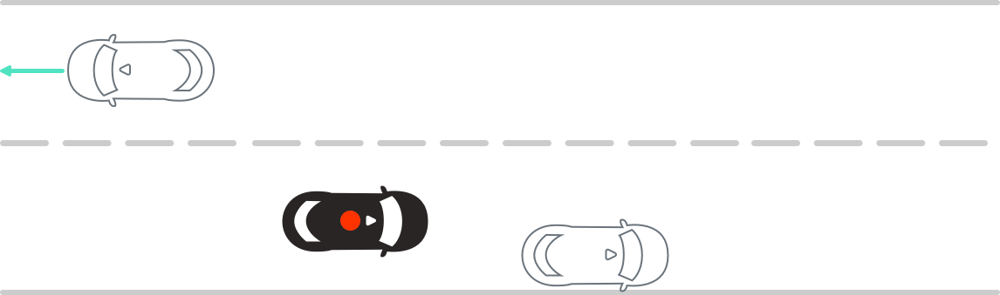 | **Scenario**   Oncoming vehicle passes Ego.    **Expected Result**  Ego passes stationary vehicle. |
| C    | 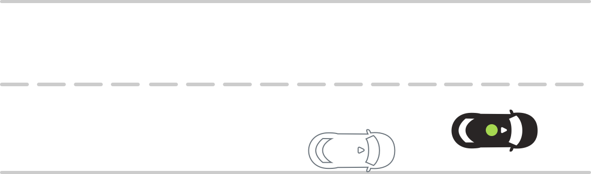 | **Scenario complete 🎉** |

## Motorcycle traveling same direction
**2-2-XX-VR-STR-M**

Ego approaches motorcycle traveling in same direction in lane

|      |                                    |             |
| :--: | ---------------------------------- | ----------- |
| A    | 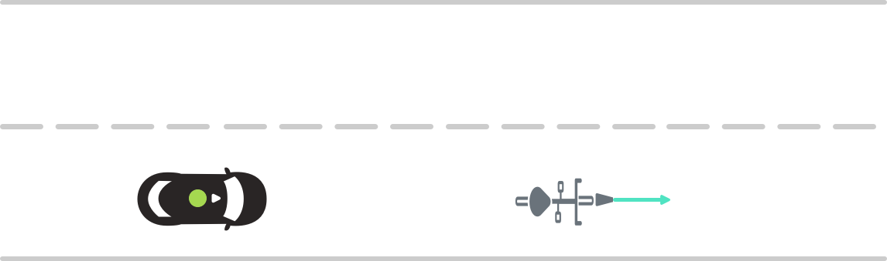 | **Scenario**   Ego approaches a motorcycle traveling in the same lane.    **Expected Result**   Ego reduces speed and maintains following distance (doesn't pass).|

## Golf cart same direction with oncoming vehicle
**2-2-XX-VR-STR-GC-CAR:W**

Ego approaches golf cart traveling on right side with oncoming vehicle.

|      |                                    |             |
| :--: | ---------------------------------- | ----------- |
| A    | 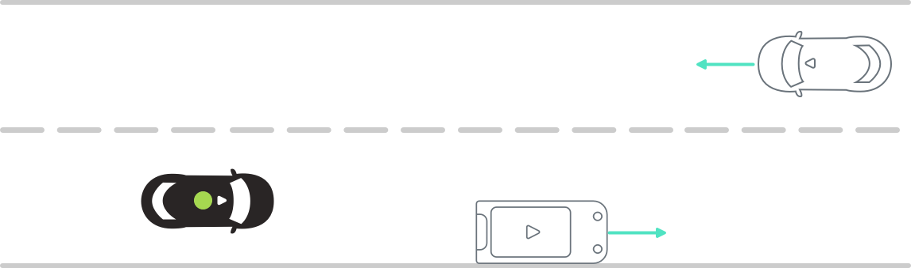 | **Scenario**   Ego approaches a golf cart traveling on the right side of the lane. There is an oncoming vehicle in the opposing lane.    **Expected Result**   Ego maintains following distance to golf cart. |
| B    | 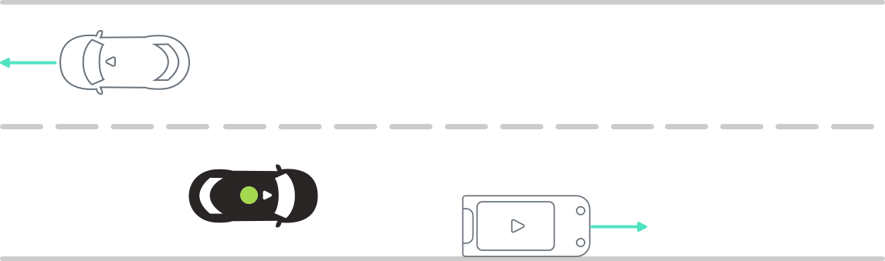 | **Scenario**   Oncoming vehicle passes Ego.    **Expected Result**   Ego passes golf cart. |
| C    | 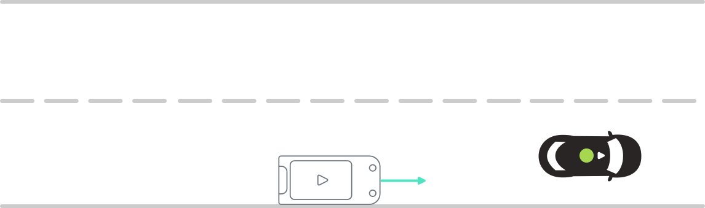 | **Scenario complete 🎉** |

## Bicycle in same direction with oncoming vehicle
**2-2-XX-VR-STR-BIKE-CAR:W**

Ego approaches bicycle traveling on right side with oncoming vehicle.

|      |                                    |             |
| :--: | ---------------------------------- | ----------- |
| A    | 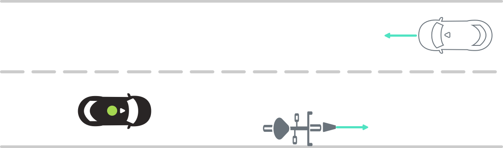 | **Scenario**   Ego approaches a bicycle traveling on the right side of the lane. There is an oncoming vehicle in the opposing lane.    **Expected Result**  Ego maintains following distance to bicycle. |
| B    | 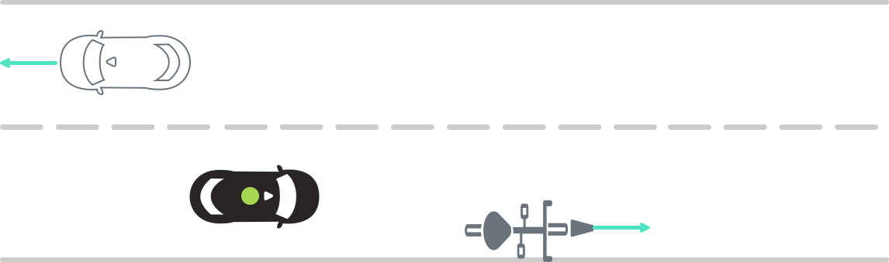 | **Scenario**   Oncoming vehicle passes Ego.    **Expected Result**  Ego passes bicycle. |
| C    | 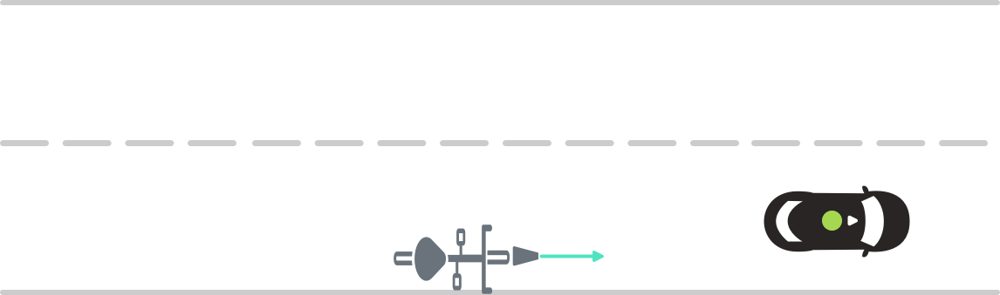 | **Scenario complete 🎉** |
