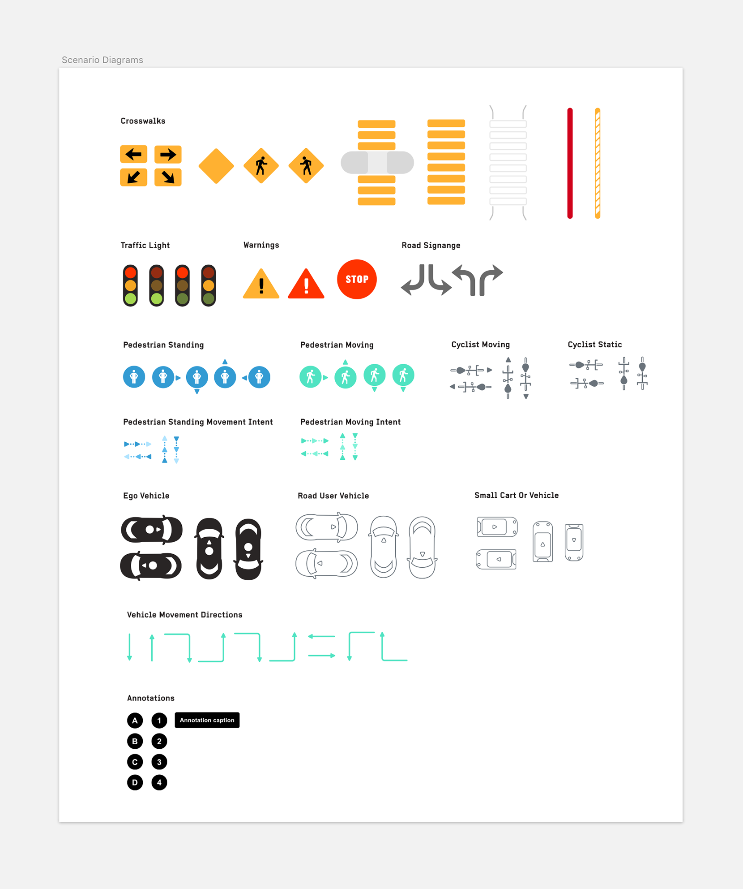
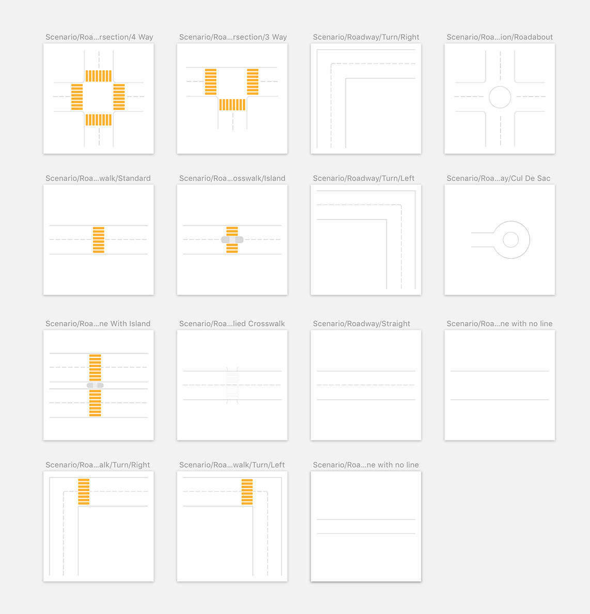

# Testing Toolkit

:::warning STATUS
Alpha - Work In Progress
:::

# Testing Toolkit

The OAS Testing Toolkit is a Sketch library and asset collection designed to quickly and effectively communicate testing scenarios. The Testing Toolkit is best used with Sketch Libraries but it can also be used in word documents, presentations or any software with graphic importing capabilities.

All testing scenarios seen in the current version of the OAS use the Testing Toolkit and we welcome contributions to improve the kit for the future.  

<a href="/voyage_open_autonomous_safety_testing_toolkit_1.0.zip" class="nav-link action-button">Download Testing Toolkit 1.0 ↓</a>

1.2MB .zip file includes .sketch file and .png flat assets.

## Diagram assets included

* Crosswalks
* Ego, road user and small cart vehicles
* Vehicle direction
* Traffic lights
* Road signage
* Warning markers
* Cyclist
* Pedestrian static
* Pedestrian moving or with intent to move
* Annotations points and captions
* Stop lines

## Roadway scenario assets included

* 3 way intersection with crosswalks
* 3 way intersection with crosswalks
* Straight road with crosswalk
* Straight road with implied crosswalk
* Straight road with crosswalk and island
* 2 lane straight road with crosswalks and island
* Left turn
* Left turn with crosswalk
* Right turn
* Right turn with crosswalk
* Roundabout
* Single lane
* Single lane to Cul De Sac

<a href="/voyage_open_autonomous_safety_testing_toolkit_1.0.zip" class="nav-link action-button">Download Testing Toolkit 1.0 ↓</a>

1.2MB .zip file includes .sketch file and .png flat assets.

